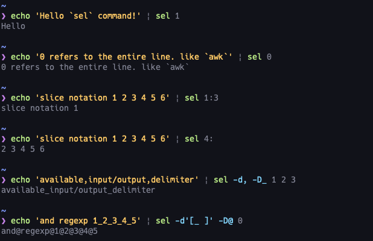

# sel
**sel**ect columns  


extra _cut(1)_ command with `awk`'s column selection and slice notation.



# Install
## go install
```
$ go install github.com/xztaityozx/sel
```

## Download binary from GitHub Releases
Download prebuild binary from [release page](https://github.com/xztaityozx/sel/releases)


## (Optional) Shell completion script
Completion script is available for bash, fish, PowerShell and zsh.

```sh
# example
# for bash
$ source <(sel completion bash)
# for fish
$ sel completion fish | source
# for PowerShell
$ sel completion powershell | Out-String | Invoke-Expression
# for zsh
$ sel completion zsh > ${fpath[1]}/_sel
```

# Usage

```
          _ 
 ___  ___| |
/ __|/ _ \ |
\__ \  __/ |
|___/\___|_|

__sel__ect column

Usage:
	sel [queries...]

Query:
	index                        select 'index'
	start:stop                   select columns from 'start' to 'stop'
	start:stop:step              select columns each 'step' from 'start' to 'stop'

	start:/end regexp/           select columns from 'start' to /end regexp/
	/start regexp/:end           select columns from /start regexp/ to 'end'
	/start regexp/:/end regexp/  select columns from /start regexp/ to /end regexp/

Examples:

	$ cat /path/to/file | sel 1
	$ sel 1:10 -f ./file
	$ cat /path/to/file.csv | sel -d, 1 2 3 4 -- -1 -2 -3 -4
	$ sel 2:: -f ./file

Available Commands:
  completion  Generate completion script
  help        Help about any command

Flags:
      --csv                       parse input file as CSV
  -a, --field-split               shorthand for -gd '\s+'
  -h, --help                      help for sel
  -d, --input-delimiter string    sets field delimiter(input) (default " ")
  -f, --input-files strings       input files
  -D, --output-delimiter string   sets field delimiter(output) (default " ")
  -r, --remove-empty              remove empty sequence
  -S, --split-before              split all column before select
      --tsv                       parse input file as TSV
  -g, --use-regexp                use regular expressions for input delimiter
  -v, --version                   version for sel

Use "sel [command] --help" for more information about a command.

```

# Features
- one-indexed
- index `0` refers to the entire line. (like `awk`)
- slice notation
