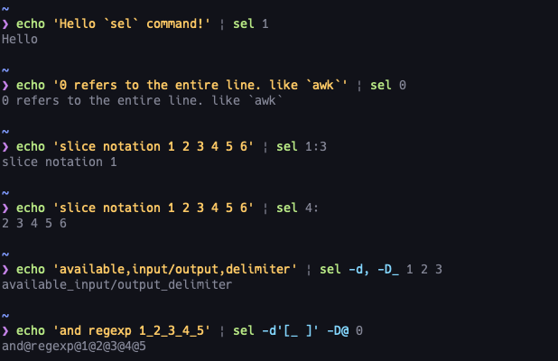

# sel
**sel**ect columns  


extra _cut(1)_ command with `awk`'s column selection and slice notation.



# Install
## go install
```
$ go install github.com/xztaityozx/sel
```

## Download binary from GitHub Releases
Download prebuild binary from [release page](https://github.com/xztaityozx/sel/releases)


## (Optional) Shell completion script
Completion script is available for bash, fish, PowerShell and zsh.

```sh
# example
# for bash
$ source <(sel completion bash)
# for fish
$ sel completion fish | source
# for PowerShell
$ sel completion powershell | Out-String | Invoke-Expression
# for zsh
$ sel completion zsh > ${fpath[1]}/_sel
```

# Usage

```

          _ 
 ___  ___| |
/ __|/ _ \ |
\__ \  __/ |
|___/\___|_|

__sel__ect column

Usage:
	sel [queries...]

Query:
	index                        select 'index'
	start:stop                   select columns from 'start' to 'stop'
	start:stop:step              select columns each 'step' from 'start' to 'stop'

	start:/end regexp/           select columns from 'start' to /end regexp/
	/start regexp/:end           select columns from /start regexp/ to 'end'
	/start regexp/:/end regexp/  select columns from /start regexp/ to /end regexp/

	-x/--exclude takes 'index' or 'start:stop[:step]' and drops those columns before
	the queries are evaluated. Without queries, every remaining column is printed

Examples:

	$ cat /path/to/file | sel 1
	$ sel 1:10 -f ./file
	$ cat /path/to/file.csv | sel -d, 1 2 3 4 -- -1 -2 -3 -4
	$ cat /path/to/file.csv | sel --csv 1 2 3 4
	$ sel 2:: -f ./file
	$ cat /path/to/file | sel /^begin/:/^end/
	$ echo AAA BBB CCC | sel --template 'one: {} two: {} three: {}' 1 2 3
	$ echo AAA BBB CCC | sel -x 2

Available Commands:
  completion  Generate completion script
  help        Help about any command

Flags:
      --csv                       parse input file as CSV
  -x, --exclude strings           exclude columns (index or range query)
  -a, --field-split               shorthand for -gd '\s+'
  -E, --fill-missing string       fill value for out-of-range columns (implies -M)
  -h, --help                      help for sel
  -M, --ignore-missing            output empty string for out-of-range columns instead of error
  -d, --input-delimiter string    sets field delimiter(input) (default " ")
  -f, --input-files strings       input files
  -D, --output-delimiter string   sets field delimiter(output) (default " ")
  -r, --remove-empty              remove empty sequence
  -S, --split-before              split all column before select
  -t, --template string           template for output
      --tsv                       parse input file as TSV
  -g, --use-regexp                use regular expressions for input delimiter
  -v, --version                   version for sel

Use "sel [command] --help" for more information about a command.
```

# Features
- one-indexed
- index `0` refers to the entire line. (like `awk`)
- slice notation
- a range query writes only the columns the line has, so `1:10` on a 3-column line writes 3
  and `10:12` writes nothing. Only a single index (`4`, `4:4`) reports an out-of-range column
- an empty delimiter (`-d ''`, `-g -d ''`) splits a line into runes. (like `gawk`'s `FS=""`)
- template output (`-t`, `--template`)
- column exclusion (`-x`, `--exclude`)

# Exclude
`-x`/`--exclude` drops columns, like `cut --complement`. It takes the same `index` and
`start:stop[:step]` notation as a query (switch queries such as `/a/:/b/` and index `0`
are not accepted).

Exclusion happens **before** the queries are evaluated, and the remaining columns are
renumbered from 1. With no query at all, every remaining column is printed.

```console
$ echo a b c d e | sel -x 2
a c d e

$ echo a b c d e | sel -x 2 -x 4     # -x 2,4 does the same
a c e

$ echo a b c d e | sel -x 2:4
a e

$ echo a b c d e | sel -x 2 1:3      # 1..3 of the columns left after dropping 2
a c d
```

Excluding a column that the line does not have is a no-op, not an error, so `-M`/`-E` are
not involved. Index `0` (the entire line) prints the remaining columns joined by the
output delimiter.

# Template
`-t`/`--template` formats a line with its own tiny syntax. It is *not* Go's `text/template`.

| notation | output |
| --- | --- |
| `{}` | the next selected column |
| `{{` | a literal `{` |
| `}}` | a literal `}` |
| `{{}}` | a literal `{}` |

Any other character, including an unmatched `{` or `}`, is written as-is.

```console
$ echo AAA BBB CCC | sel --template 'one: {} two: {} three: {}' 1 2 3
one: AAA two: BBB three: CCC

$ echo AAA BBB | sel --template '{"key": "{}"}' 1
{"key": "AAA"}
```

Selecting more columns than there are placeholders drops the extras, while selecting
fewer is an error.

```console
$ echo AAA BBB | sel --template '{} {} {}' 1 2
sel: <stdin>:1: template expects 3 columns but query produced 2
```

`-M`/`-E` fill out-of-range columns, so their placeholders are filled too. This also
applies when a range query (`1:10`, `1:`, ...) runs out of columns before it fills every
placeholder it was assigned, not just a plain out-of-range index.

```console
$ echo AAA BBB | sel -M --template '1st={} 5th={}' 1 5
1st=AAA 5th=

$ printf 'AAA BBB\nAAA\n' | sel -M --template '[{}|{}]' 1:2
[AAA|BBB]
[AAA|]
```

Without `-t`/`--template`, a range query never errors on short lines (it just prints
fewer columns instead), and `-M`/`-E` has no effect there since there is nothing to pad.

Index `0` (the entire line) always fills exactly one placeholder, even when it is
made of several columns joined by the output delimiter, or when the line is empty.

```console
$ printf 'a b\n\nc d\n' | sel --template '<{}>' 0
<a b>
<>
<c d>
```
